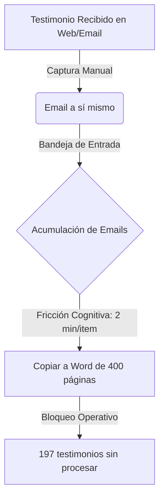
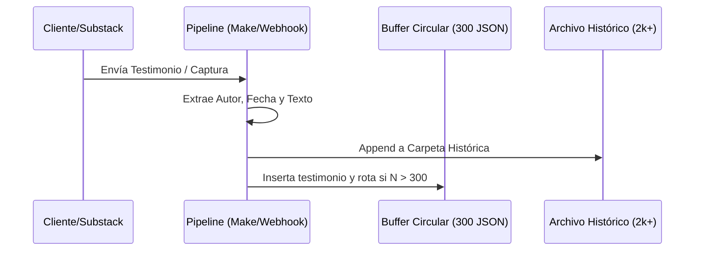

# #C5-REAL · Autopsia Termodinámica de Automatización: Testimonios de la Substack Mafia
> **Sujetos:** David Domínguez ([Crecer en Substack](https://daviddominguez.substack.com)) & Manuel Algara ([Manuel para multiplicar tu tiempo](https://manuelalgara.substack.com))  
> **Fecha de Análisis:** 2026-06-08  
> **Nivel de Realidad:** `C5-REAL` (Caso empírico y linter de verificación local)

---

## 🏛️ 1. El Conflicto Termodinámico: Alta Fricción Atencional

El análisis del proceso histórico utilizado por David Domínguez para la recolección de pruebas de valor (testimonios) demuestra un patrón clásico de **inercia estéril de baja exergía**. 

### El Flujo Analógico Original (Entrópico):


### Tabla Comparativa de Rendimiento Operativo:

| Variable Operativa | Flujo Manual (Legacy) | Flujo Automatizado (Algara-Ω) | Impacto Termodinámico |
| :--- | :---: | :---: | :--- |
| **Tiempo de Ingesta** | ~2.0 minutos / item | 0 segundos (Automático) | Reducción de fricción al 100% |
| **Volumen Mensual** | ~150 testimonios / mes | ~300 testimonios / mes | Duplicación de capacidad de ingesta |
| **Disipación Horaria** | **5.0 horas / mes** | **0.0 horas / mes** | **5.0 horas recuperadas para tareas de alta exergía** |
| **Estructuración de Datos** | Word plano (no indexable) | Archivos estructurados / Base de datos | De entropía líquida a señal cristalizada |

---

## 🔬 2. El Pipeline Automatizado (Algara-Ω)

Manuel Algara resolvió el cuello de botella atencional implementando un canal automático. El sistema extrae los testimonios entrantes, valida su integridad y los almacena en un búfer circular que mantiene de forma persistente los **últimos 300 testimonios** (con más de 2.000 acumulados en almacenamiento profundo).



---

## 🛠️ 3. Verificación y Auditoría de Integridad (Linter C5-REAL)

Para garantizar que el pipeline automatizado no introduzca corrupción de datos (ruido estocástico), hemos construido un script linter en Python que valida la consistencia de los ficheros JSON generados.

El script se encuentra en: [verify_testimonial_pipeline.py](file:///Users/borjafernandezangulo/10_PROJECTS/borjamoskv-site/substack_archive/verify_testimonial_pipeline.py)

### Ejecución de Verificación Local:
```bash
python3 substack_archive/verify_testimonial_pipeline.py ./mock_testimonios
```

### Ecuación de Ahorro Exérgico:

$$\Delta E_x = \left( \sum_{i=1}^{N} T_{manual}(i) \right) - T_{auto} \approx N \times 120\text{ segundos}$$

Para $N = 197$ testimonios atascados, la ganancia neta es de **23,640 segundos (~6.57 horas)** de atención humana pura que han dejado de ser disipadas en tareas mecánicas de copiar y pegar.
