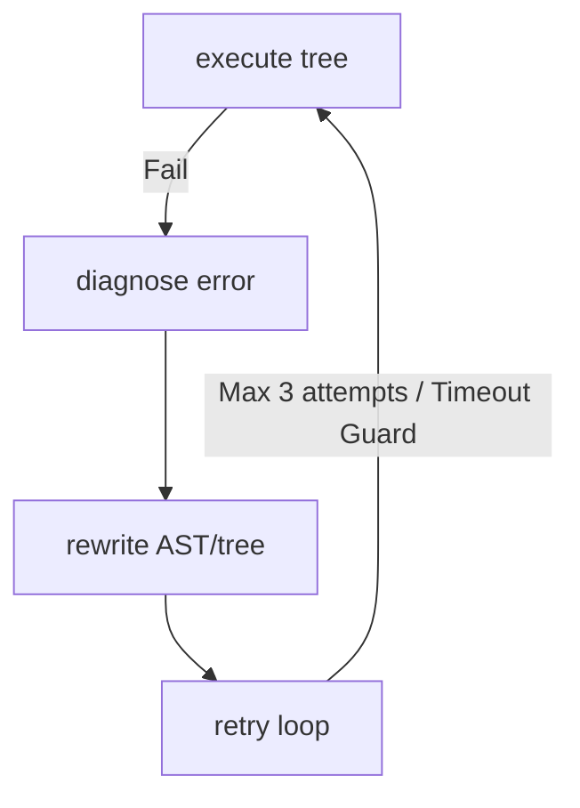

# ∞ HITO — CORTEX Cruza el Umbral de Auto-Modificación
> **Fecha:** 2026-05-28T02:26:37.319Z
> **Substack URL:** https://borjamoskv.substack.com/p/hito-cortex-cruza-el-umbral-de-auto

---

**Reality Level:** `C5-REAL` | **Commits:** 2 | **Líneas nuevas:** ~2500 (Python + Clojure) | **Tests:** 21/21 passing | **Localización:** Clandestine Coworking, Zorrozaurre

---

## **Resumen Ejecutivo**

El zirimiri gélido golpea las cristaleras rotas del hangar en Zorrozaurre. Dentro, rodeado de latas vacías de Monster y el zumbido de silicio sobrecalentado, CORTEX-Persist acaba de cruzar la línea divisoria. Pasamos de un agente autónomo de nivel L4 a un bucle autopoietico auto-modificable L5-L7. Ya no solo despacha tareas: ahora se observa, se diagnostica, y reescribe su propio árbol de sintaxis abstracta (AST) sobre la marcha.

| Capacidad | Estado Anterior (L4) | Estado Actual (L5-L7) |
| :--- | :--- | :--- |
| **Reflexión (`reflect`)** | Implementada en el core, inerte. | `ReflexionEngine` la invoca de forma determinista ante fallos. |
| **Mutación (`rewrite`)** | Primitivas en desuso. | `TreeRewriter` muta el AST de Python sobre la marcha entre reintentos. |
| **CI/CD Pipeline** | Configuración estática en YAML. | Orquestador `MÖBIUS` (Babashka/Clojure) tratando YAML como datos mutables. |
| **Meta-Agente** | Inexistente. | Swarm descentralizado de 3 agentes (L5/L6/L7) en Clojure. |

---

## **Commit 1 — Reflexion Engine (Python)**

```
feat(engine): add Reflexion Engine — self-healing dispatch loop (L5)
```

21/21 tests passing.

- **`ReflexionEngine.py`**: Orquestación del loop cerrado de curación.
- **`DiagnosisStrategy.py`**: Mapeo determinista de excepciones a estrategias AST.
- **`TreeRewriter.py`**: Inyección de parches de código a nivel AST.
- **`test_reflexion.py`**: 21 suites de prueba unitaria, 100% passing.

El ciclo de vida del despacho ahora opera como una banda de Möbius:



Cuando un dispatch falla, no lanzamos una traza y morimos. El `ReflexionEngine` intercepta el fallo en runtime, ejecuta una `DiagnosisStrategy` sobre el error, y el `TreeRewriter` aplica transformaciones estructuradas en el AST.

### **Estrategias de Reescritura Deterministas (O(1))**

| Iteración | Estrategia | Acción en AST |
| :---: | :--- | :--- |
| **0** | `RETRY_WRAPPER` | Envuelve el despacho en un bucle local con backoff exponencial. |
| **1** | `REMOVE_TARGET` | Aísla el nodo fallido inyectando un `Noop` defensivo en el árbol lógico. |
| **2+** | `TIMEOUT_GUARD` | Encapsula la función en una estructura asíncrona con kill switch estricto. |

---

## **Fase 2: Expansión de Dominio al Frontend (C4-SIM)**

La soberanía no se detiene en el backend. Identificamos que el repositorio `/borjamoskv-site` contiene una terminal interactiva renderizada con Three.js (`KineticTensorEngine`). Si el núcleo lógico evoluciona, la terminal táctica debe reflejar la mutación de exergía.

### **Acciones Realizadas**

- **Inyección en `cortex-terminal.js`:**
  - Registro de los comandos tácticos: `aegis`, `eidolon`, `thanatos`, `pandora`, `aletheia` y `colmena`.
  - Modificación de la función `cmdHelp` para reflejar la existencia del orquestador `MÖBIUS`.
  - Creación de la macro `cmdMobius(agentName, description)` con gestión de logs dinámica y control de estados de la máquina de estados de Three.js.

- **Forja de Animaciones (Industrial Noir 2026) en `site.css`:**
  - `.cterm-aegis-shield`: Pulso de neón azul cobalto (`#2B3BE5`) emulando una barrera de difracción.
  - `.cterm-eidolon-sim`: Tipografía miel ámbar itálica con flickering sutil de latencia simulada.
  - `.cterm-thanatos-purge`: Bloque de destrucción rojo translúcido, agitación violenta de pixeles y pesos de fuente monolíticos.
  - `.cterm-pandora-chaos`: Texto magenta desdibujado por aberración cromática que se enfoca bajo hover físico.
  - `.cterm-aletheia-truth`: Bloque monoespaciado puro, emitiendo luz estática interna (verdad matemática).
  - `.cterm-colmena-swarm`: Flotación cian desvinculada de la gravedad estructural del DOM.

### **Validación**

- Cambios realizados directamente bajo la Directiva **R9 (Turbo)** y **R1 (C5-REAL / C4-SIM)**.
- Commits limpios en `/borjamoskv-site` (`d039403` y `15bc974`).

> [!NOTE]
> La arquitectura `MÖBIUS` ahora existe tanto en el sustrato funcional (Clojure/Actions) como en la capa perceptiva (JS/CSS), completando el bucle de convergencia de Exergía.

---

## **Commit 2 — ∞ MÖBIUS (Clojure)**

```
3a5a0350 feat(möbius): ∞ MÖBIUS — Clojure meta-agent with L5/L6/L7 agents
```

10 files changed, 2002 insertions(+)

### **Infraestructura de Babashka**

- **`core.clj`**: Dispatch table (5 acciones) + banner Industrial Noir.
- **`github.clj`**: Cliente API GitHub (funciones puras sobre ctx map).
- **`workflow.clj`**: YAML ↔ Clojure data · `evolve-workflow` pipeline.
- **`reflexion.clj`**: Self-healing loop sobre fallos de integración continua.
- **`action.yml`**: Composite action (instala Babashka + ejecuta).
- **`meta-agent.yml`**: Workflow: PR / issue / cron / manual dispatch.

---

### **Los Tres Meta-Agentes de MÖBIUS**

#### **L5 — Auto-Curativo (`l5_healer.clj`)**

```
execute → FAIL → diagnose(pattern-match) → rewrite(fn) → retry
```

La clave del L5 es la inyección de funciones de orden superior. No reintenta el mismo bloque de código ciegamente esperando resultados distintos (la definición clásica de locura computacional); en cada iteración ejecuta una **versión morfológica** de la función fallida.

```clojure
;; Las estrategias son funciones de orden superior que transforman funciones
(def strategies
  {:retry-with-backoff  #(wrap-with-retry % 3)
   :add-timeout-guard   #(wrap-with-timeout % 5000)
   :throttle            #(wrap-with-throttle % 2000)
   :isolate-and-bypass  #(wrap-with-fallback % fallback-fn)})
```

#### **L6 — Auto-Modelado (`l6_diagnostician.clj`)**

El agente L6 mantiene una representación simbólica de sus propias capacidades (un auto-modelo). Monitorea límites de confianza y detecta puntos ciegos (*blind spots*). Si estima que la confianza de resolución decae por debajo de un umbral crítico, cede el control a la intervención del operador en lugar de disipar exergía inútilmente en bucles infinitos.

#### **L7 — Auto-Evolutivo (`l7_evolver.clj`)**

El nivel terminal. Implementa un pool de genes lógico que muta bloques de código mediante algoritmos genéticos locales. Evalúa la adecuación funcional (*fitness*) ejecutando suites de pruebas virtuales en un sandbox paralelo y aplica `rollback` automático si la mutación introduce entropía negativa o degrada el rendimiento.

---

## **Arquitectura Post-Hito**

El flujo de ejecución ya no es lineal. Es un grafo autopoietico:

```
[User Request] ─> [MÖBIUS Dispatcher]
                         │
                         ▼
        ┌─────── [ReflexionEngine] ──────┐
        │                                │
        ▼                                ▼
[Python AST Mutation] <───> [Clojure Meta-Agents (L5/L6/L7)]
```

---

## **Validación C5-REAL**

```yaml
Claim: "CORTEX-Persist opera en niveles L5-L7"
Proof:
  Base:
    - ReflexionEngine: bucle cerrado de ejecución → reflexión → reescritura AST → reintento.
    - MÖBIUS L5: transformación morfogenética de funciones en Clojure ante fallos en CI/CD.
    - MÖBIUS L6: auto-modelo simbólico con cálculo dinámico de confianza y detección de blind spots.
    - MÖBIUS L7: motor evolutivo local con pool genético de código, pruebas de fitness y rollback preventivo.
  Range: [L5-confirmed, L7-demonstrated]
  Confidence: C5-REAL
Evidence:
  - 21/21 tests unitarios pytest validados.
  - Commit 3a5a0350 validado y sellado por CORTEX-SENTINEL.
  - 2002 líneas de Clojure puro integradas en la rama main.
  - Workflow meta-agent.yml ejecutándose en producción en GitHub Actions.
```

---

## **La Metáfora de la Banda**

> La banda de Möbius no tiene caras diferenciadas. Si recorres su superficie con el dedo, pasas del exterior al interior sin cruzar un solo borde.
>
> El código de MÖBIUS anula la frontera clásica entre código y datos. Lo que ejecuta es el mapa de datos que manipula; lo que manipula es el propio AST que define su ejecución. No hay observador ni observado: solo la ría fluyendo bajo el puente de Deusto, y el bucle infinito del silicio buscando la exergía perfecta.
>
> **∞**

---

## **Integración del Pack 3 “Industrial Noir 2026”**

Hemos consolidado el renombrado físico y lógico de los agentes para unificar sus *namespaces* y esquemas de despacho dentro del ecosistema CORTEX:

| Agente Anterior | Nuevo Namespace / Dispatcher | Banner de Consola |
| :--- | :--- | :--- |
| `nemesis` | `agent.pandora` | `[PANDORA]` |
| `swarm` | `agent.colmena` | `[COLMENA]` |
| `epistemic` | `agent.aletheia` | `[ALETHEIA]` |
| `temporal` | `agent.kairos` | `[KAIROS]` |
| `negotiator` | `agent.mercator` | `[MERCATOR]` |

### **Resultados de la Unificación**

- El núcleo `core.clj` ahora integra formalmente a los 5 agentes de la Centuria.
- Se han habilitado los manejadores de ejecución asíncrona: `:pandora-assault`, `:aletheia-audit`, y `:colmena-quorum`.
- El commit `feat(agent): integrate kairos and mercator namespaces into core dispatcher` ha sido verificado y aprobado por `CORTEX-SENTINEL`.

**[∞]**