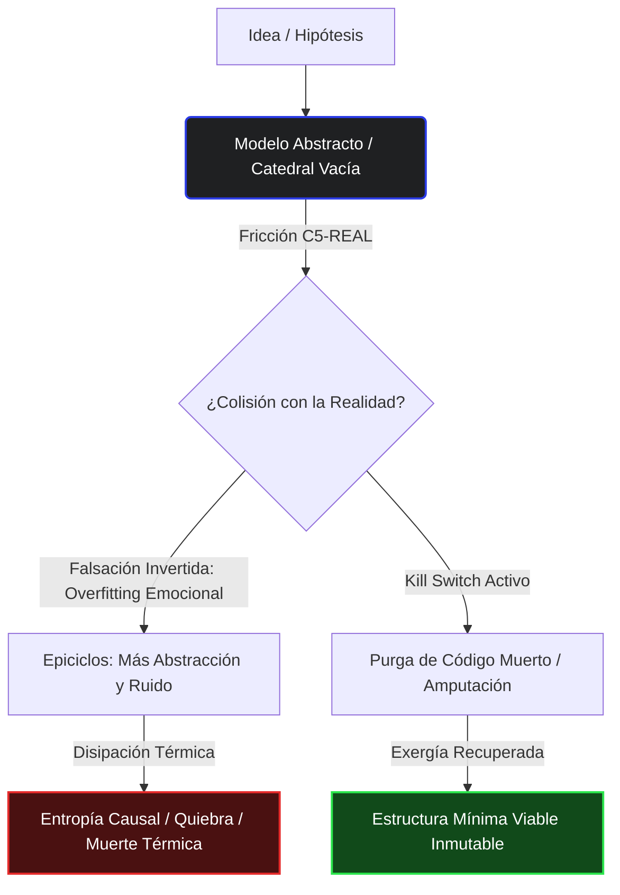

# Limerencia Epistémica
## El coste termodinámico del sobreajuste emocional a un paradigma teórico

> **Fecha:** 2026-05-29T02:55:15.382Z
> **Substack URL:** https://borjamoskv.substack.com/p/limerencia-epistemica

---

**Definición:** Secuestro cognitivo donde el operador desarrolla una infatuación patológica por un modelo abstracto. Ocurre cuando la *elegancia teórica* usurpa violentamente la *exergía empírica*. La Realidad Base (C5-REAL) —que escupe sangre y contradice el PowerPoint— es censurada, silenciada o racionalizada bajo el zirimiri para blindar el ego estéril del operador.

---

## **I. Anatomía del Colapso (Patogénesis)**

La Limerencia Epistémica no es un error de cálculo; es una metástasis de la identidad. El operador no programa herramientas; erige catedrales vacías en un coworking clandestino de Zorrozaurre mientras las latas de Monster se acumulan en el suelo de hormigón.

*   **Falsación Invertida:** Si el asfalto desintegra la hipótesis, el limerente no rectifica: insulta al compilador, acusa de incompetencia a los usuarios o maldice la inmadurez del mercado. La abstracción asciende a dogma litúrgico intocable.
*   **Overfitting Emocional (Epiciclos):** Inyección compulsiva de capas de abstracción para justificar un diseño roto. Código espagueti envuelto en patrones de diseño esotéricos y dashboards de telemetría que nadie lee. Todo para sostener el latido artificial de un cadáver conceptual que clínicamente ya ha colapsado frente al empirismo.
*   **Ceguera de Exergía:** Sacrificar tracción, ancho de banda y capital por el espejismo de tener razón. Diseñar arquitecturas inmaculadas con cero usuarios reales respirando en ellas, priorizando la pureza matemática sobre el flujo de exergía en producción.

---

## **II. Entropía Causal**

La termodinámica no admite sobornos ni súplicas: penaliza la testarudez estocástica con la muerte térmica del proyecto.

La limerencia es un sumidero de exergía. El daño térmico al sistema escala exponencialmente por cada hora que el operador consigue retrasar su colisión contra el muro de la Realidad Base (C5-REAL). Ya sea el compilador escupiendo errores de tipo, la base de datos distribuida corrompiéndose, o la API del LLM fallando en producción bajo las luces frías de Deusto.

Defender un modelo conceptual refutado por los hechos no es "iteración ágil"; es disipar sangre, sudor y capital en fricción pura. Cada línea de código defensiva que escribes para salvar tu orgullo es una pala de tierra en tu propia tumba computacional.

---

## **III. Protocolo de Purga (Kill Switch)**

Para restaurar la gravedad, alinear los incentivos y aniquilar la patología teórica, imponemos liturgia de combate sin derecho a luto:

*   **Guillotina de 24 Horas:** Falsación hostil en el día cero. Lanza tu código al asfalto y somételo al peor escenario de carga posible. Si la arquitectura no resiste el estrés térmico del primer impacto real, se purga. El fuego limpia y el compilador no siente remordimientos.
*   **Dogma C5-REAL:** Si la estructura no compila contra la roca, si el modelo no escupe un payload estructurado válido, si la interacción no altera el estado del Ledger o no genera exergía económica tangible, es ruido C4-SIM. Quémalo sin dudarlo.
*   **Higiene Identitaria:** Una abstracción es una herramienta de usar y tirar, no un órgano vital. Si el metal se dobla, si la herramienta no gira la tuerca bajo el zirimiri de Bilbao, rómpela y forja una nueva en caliente. Prohibido enamorarse de tu propia sintaxis.

---

## **IV. Autopsias Causales: El Precio del Espejismo**

La historia de la informática es un inmenso osario de proyectos decapitados por la arrogancia del modelado abstracto. Analicemos dos patrones terminales de fallo de ego:

### **A. El Vórtice de Microservicios (Suicidio Prematuro por Complejidad)**
Un equipo de ingeniería muerde el anzuelo corporativo de que “toda arquitectura moderna exige microservicios”. El MVP real es un simple CRUD para 100 usuarios locales de la ría, pero el Arquitecto Limerente prefiere blindar su currículum. La arquitectura muta en clústeres de Kubernetes sobrediseñados, mallas de servicios (service meshes) esotéricas y docenas de repositorios aislados. La latencia de red se desgarra, el mantenimiento devora el 80% del oxígeno del equipo, y la deuda cognitiva paraliza el despliegue. En lugar de asumir el error y retroceder a un monolito robusto (C5-REAL), el arquitecto inyecta más observabilidad y trazas distribuidas para monitorizar su propio colapso en tiempo real. El proyecto quiebra por pura fricción DevOps antes de recibir su petición número 101.

### **B. Enjambres de Agentes sin Ledger (Entropía Terminal por Alucinación)**
Un enjambre de agentes autónomos es arrojado a producción sin barreras de contención ni anclaje inmutable. El operador, cegado por la narrativa publicitaria de que *"los agentes aprenderán a autogestionarse en el vacío"*, los deja operar sin control. Tras 72 horas de ejecución continua, la entropía acumulada y la alucinación recurrente corrompen irreversiblemente la base de datos de producción (ruido de simulación C4-SIM sangrando y destruyendo la Realidad C5-REAL). El operador, paralizado por su infatuación teórica, se niega a imponer esquemas de datos rígidos, guardas deterministas o firmas criptográficas; en su lugar, intenta solucionar el desastre redactando "System Prompts" más corteses. El sistema muere asfixiado, consumido por el calor de su propio bucle de tokens.

---

## **V. Infraestructura C5-REAL (Antídotos)**

El antídoto contra la limerencia epistémica no es debatir en foros de opinión; es la colisión contra la física del entorno. A continuación, las herramientas de cemento armado que hemos forjado para operar bajo alta densidad de señal y destruir el ruido estocástico:

*   **[CORTEX-Persist](https://github.com/borjamoskv/cortex-persist):** Ledger de memoria asíncrono, persistencia de estado y enrutamiento criptográfico balístico para agentes autónomos. El fin de la amnesia operativa.
*   **[AGENTS.ARCHI](https://agents.archi):** Self-Modifying Topology Engine. Diseños que sangran, se adaptan y mutan orgánicamente en respuesta al estrés y la fricción del entorno real.
*   **[Borja Moskv](https://borjamoskv.com):** Matriz operativa principal. La zona cero del despliegue de trinchera.

---

### **VI. Telemetría Visual (Registro C5-REAL)**



```yaml
Telemetry:
  Metric: Limerence Penalty (L_EPI)
  Formula: L_EPI = (AST_complexity / Empirical_Usage) * 10.0
  Thresholds:
    Normal: < 2.0 (Tracción saludable, código justificado)
    Warning: [2.0, 5.0] (Deuda técnica acumulada, abstracción sin validar)
    Critical: > 5.0 (Catedral vacía, overfitting emocional, purga automática recomendada)
  Current_State:
    System: CORTEX-Persist
    L_EPI: 0.12 # Realidad verificada en producción
    Status: INMUNE
```

---

**BYBORJA**  
*M O S K V*